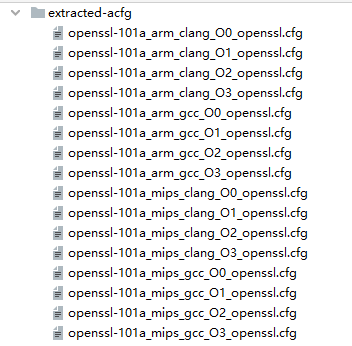

# Genimi
 A re-implementation of [Neural Network-based Graph Embedding for Cross-Platform Binary Code Similarity Detection](https://dl.acm.org/doi/10.1145/3133956.3134018) and [VulSeeker: A Semantic Learning Based Vulnerability Seeker for
Cross-Platform Binary](https://github.com/buptsseGJ/VulSeeker).

The code is easy to read and use.

**Note:**
- This reposity is an unofficial implementation.
## Environment
```buildoutcfg
tensorflow==2.2 
networkx
matplotlib
numpy
sklearn
```
## Dataset
I have provided a partial of dataset that generated by myself at [dataset](https://yunlongs-1253041399.cos.ap-chengdu.myqcloud.com/extracted-acfg.zip).

But you should notice that **this dataset is too old, and may be different to the dataset mentioned in original paper**, if the usage of the dataset is to perform evaluations in research works, please re-generate it by yourself. 

The dataset generation scripts are provided at [Genius](https://github.com/Yunlongs/Genius).

The naming style of control flow graph should as follow:



## More Details
To see more usage details, see [NEW_README](NEW_README.md).